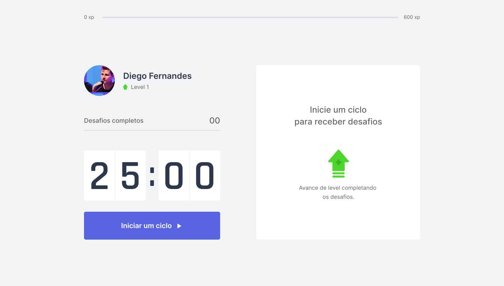

<p align="center">
  
</p>


<p align="center">
  
</p>

# :pushpin: Content

- [:pushpin: Content](#pushpin-content)
- [:satisfied: About](#satisfied-about)
- [:snowflake: Technologies](#snowflake-technologies)
- [:question: Run project](#question-run-project)

---
# :satisfied: About
The Time to Move project, developed during the fourth edition of NextLevelWeek by [Rocketseat](https://rocketseat.com.br/) on the React track, consists of helping people to control their time in front of the PC in order to make small breaks and so, rest the vision and the body. 

---
# :snowflake: Technologies
* [React](https://pt-br.reactjs.org/)
* [TypeScript](https://www.typescriptlang.org/)
* [NextJs](https://nextjs.org/)

---
# :question: Run project

1. Open your terminal in the desired folder to clone the repository and execute:
``` bash
git clone https://github.com/franciscovaz/time-to-move.git
```
2. After, execute the following commands to initialize the server:
``` bash
cd time-to-move/
```
3. Install dependencies:
``` bash
yarn install
```
4. Start server:
``` bash
yarn start
```
5. At the end you can open the project folder in your IDE and do the changes you want, and you can do some Pull Request for me to improve! 
